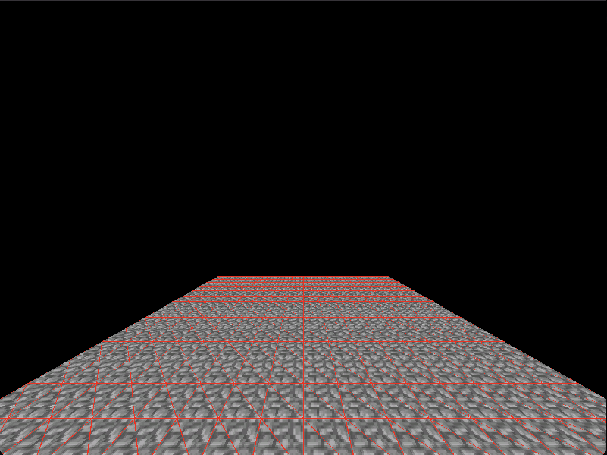

# dimensional_embedded
A rewrite of the [dimensional_graphics](https://github.com/simplyrohan/dimensional_graphics) project in C/C++ for embedded systems (ESP32 or Arduino)

# Features
 - Transformations (rotation, etc)
 - Textures
 - Tools for importing files (obj2h, tex2h)
 - Support for both desktop and embeded systems (Arduino, ESP32)
 - Supports many output methods with a simple buffer (Adafruit GFX, MiniFB)

<video width="320" height="240" controls>
  <source src="assets/embedded_cobblestone.mp4" type="video/mp4">
</video>
<video width="320" height="240" controls>
  <source src="assets/embedded_cube.mp4" type="video/mp4">
</video>




# Desktop Setup
To test this on a desktop enviroment, use [`MiniFB`](https://github.com/emoon/minifb). Just run 
```
make setup
``` 
to install it.

Then use
```
make build
```
To build with MiniFB

# Embedded Setup
To run this on an ESP32 (or any Arduino device really, but I haven't tested) make an Arduino project. Then copy the contents of the `renderer` directory into the project (Arduino is unable to find C++ files if they are in a sub directory). You can do this with
```
make setup-arduino
```

Look at `main.ino` for how to set it up with a TFT.

# obj2h
A tool to convert Wavefront OBJ files into headers compatible with this project.

```
python obj2h.py path/to/model.obj
```

# tex2h
A tool to convert images into textures for models
```
python tex2h.py path/to/image.png
```

# TODO
(This is mainly a task list for myself)
 - Rename transformations (translation->position, consolidating things into a struct, vertex->vector3, etc)
 - Scene system 
 - Fix broken rotation system (maybe use quanternions, euler sucks rn (idek if it is euler, everything is so messed up))